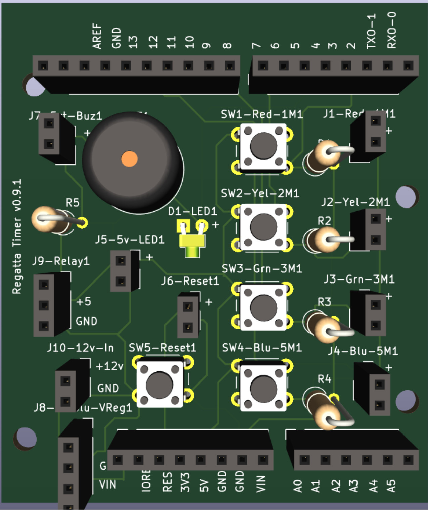

# sailingRegattaTimer
<!-- TOC depthFrom:1 depthTo:6 withLinks:1 updateOnSave:1 orderedList:0 -->

- [sailingRegattaTimer](#sailingregattatimer)
	- [Key Features](#key-features)
	- [Completed Project](#completed-project)
	- [Sponsorship](#sponsorship)
	- [Assembly Notes](#assembly-notes)
	- [Connector Wiring](#connector-wiring)
	- [Images](#images)
	- [Terminal Block Configuration](#terminal-block-configuration)
	- [Photos](#photos)
	- [Parts list](#parts-list)
	- [Tools](#tools)
	- [KiCad notes](#kicad-notes)
	- [Arduino IDE 2.x - Ubuntu Install Notes](#arduino-ide-2x-ubuntu-install-notes)

<!-- /TOC -->
## Key Features
+ on/off button to save battery
+ buzzer button for direct connection
+ timer buttons for; 1 minute, 2 minute, 3 minute and 5 minute durations
+ pc board buttons and buzzer for testing

## Completed Project
| Buttons | Buzzer | Wiring |
| - | - | - |
| | | |

## Sponsorship
+ Big shout out to PCB Way for their support on this project.
+ Customer support is great; I needed to halt production due to an incomplete design (my mistake).
+ Turn-around time from design submittal to pc board delivery was less than one week for US West coast delivery.
+ See [KiCad notes](#kicad-notes) for PCB Way plug-in installation, makes ordering PC board "one button push"

+ [PCB Way - PC Board Fabricator](https://www.pcbway.com/orderonline.aspx)

## Assembly Notes
| Area | Description |
| --- | --- |
| LED | note polarity alignment |
| PC board switch |  note orientation, may have normally closed/open side |
| pins - PC board to Arduino | dry assemble then solder to ensure alignment |
| box on/off switch | 2.5" from left side, 1.5" down |
| box buttons / lights | 4" from left edge, 1.5" down, 1.5" center spacing |

## Connector Wiring
| Black | Red | Male 1 - Timers | Male 2 - Other |
| - | - | - | - |
| Black | Red | 5 Min | 5v Light |
| White | Yellow | 3 Min | Reset |
| Orange | Green | 2 Min | 12v In |
| Blue | Purple | 1 Min | Not Used |

## Images
| Breadboard | Schematic | PC Board | KiCad 3D Image |
| - | - | - | - |
| | | |  |

## Terminal Block Configuration


## Photos
| PC Board (PCB Way)| PC Board with Parts | |
| - | - | - |
|  |  | |

| ProtoBoard 0 | ProtoBoard 1 | ProtoBoard 2 |
| - | - | - |
| |  | |

| Breadboard 0 | Breadboard 1 | Breadboard 2 |
| - | - | - |
| |  | |

## Parts list
Total cost approximately $200 (will have extra parts)
|item|quantity|description|[Ref URL](reference url)|(approx USD price)|
|---|---|---|---|---|
|item|quantity|description|[Ref URL](reference url)|(approx USD price)|
|---|---|---|---|---|
|1|1|1pc Arduino UNO|[Ref URL](https://www.amazon.com/ELEGOO-Board-ATmega328P-ATMEGA16U2-Compliant/dp/B01EWOE0UU/ref=asc_df_B01EWOE0UU?mcid=3c20e862567d3232bda82cbee4dcb2bc&hvocijid=5269161885874027834-B01EWOE0UU-&hvexpln=73&tag=hyprod-20&linkCode=df0&hvadid=721245378154&hvpos=&hvnetw=g&hvrand=5269161885874027834&hvpone=&hvptwo=&hvqmt=&hvdev=c&hvdvcmdl=&hvlocint=&hvlocphy=9033367&hvtargid=pla-2281435180978&psc=1)|17|
|2|1|1pc ELEGOO Electronic Fun Kit Bundle with Breadboard Cable Resistor, Capacitor, LED, Potentiometer total 235 Items for Arduino|[Ref URL](https://www.amazon.com/EL-CK-002-Electronic-Breadboard-Capacitor-Potentiometer/dp/B01ERP6WL4/ref=sr_1_11?crid=3E78O5C0JQMRR&dib=eyJ2IjoiMSJ9.ja6Gw2iVVjmRL_IDpxrlM_1JkWDSrarS-FIfg3YUNSdtdrMMc6kGePao5WWdf3jKhm03b97dspKyRrwA1jayXAXgh3y5mL8-M7roZnTalEGMoCrpncfMciwm_rssummXmvGSr-dyP1-Cob0TWXs_iEgvk04e52HivkEMU1jA5AgiYnM6080Viw3_bRxs-CekUHPcqsP5RitK2yjWbUTWIAoNqD28DXfaBpBz6HzTmRYiqtbo39AaUO2i1jVkDBAYL_qbY1YTQppkVhUR9CSqvGZWajfBk9ogVTgigdGSB161gCnIcicyctFr47A0c2xrzIbage1vQrp3VE0vql_cmWAdDW3s2hJN9ygKd6unQIg.PKvSQYPt9dDgSAw5WOU__V5wuUMjGVD52MEJAk5rdvw&dib_tag=se&keywords=arduino+led&qid=1738088621&s=electronics&sprefix=arduino+led%2Celectronics%2C216&sr=1-11)|10|
|3|1|1pc 12V 7Ah (7.2Ah) Lithium LiFePO4 Deep Cycle Battery|[Ref URL](https://www.amazon.com/gp/product/B0B78HTRDL/ref=ppx_yo_dt_b_search_asin_title?ie=UTF8&th=1)|27|
|4|1|1pc FARBIN Car Horn 12v Loud Motorcycle Horns High/Low Supertone Truck Horn Kit Electric Train Horn for Car (White horn with wire button)|[Ref URL](https://www.amazon.com/gp/product/B08Q86VWNH/ref=ox_sc_saved_title_8?smid=A3M8B4MVOJBZCN&th=1)|24|
|5|1|2pcs HAHIYO Electronic Buzzer Alarm 12V 400Hz Beep|[Ref URL](https://www.amazon.com/gp/product/B09H7RYFQ6/ref=ppx_yo_dt_b_search_asin_title?ie=UTF8&th=1)|9|
|6|1|1pcs Round Rocker Switch, 12V Toggle Switch, Waterproof Lighted LED|[Ref URL](https://www.amazon.com/gp/product/B0D91HGCCR/ref=ppx_yo_dt_b_search_asin_title?ie=UTF8&th=1)|6|
|7|1|1pc Pololu 5V, 600mA Step-Down Voltage Regulator D36V6F5|[Ref URL](https://www.pololu.com/product/3792)|10|
|8|1|1pc 6 Pcs Mini Plastic Boxes, 5'' x 3'' x 1.8'' Small Clear Storage Containers|[Ref URL](https://www.amazon.com/gp/product/B0CLLKK5ZK/ref=ox_sc_act_title_1?smid=A1RUKIRXEA30DB&th=1)|15|
|9|1|1pc 73Pcs(6Sets) Terminal Block Set, 6Pcs 12 Positions 600V|[Ref URL](https://www.amazon.com/dp/B08GCF76K8?ref=ppx_yo2ov_dt_b_fed_asin_title&th=1)|16|
|10|1|5pcs 8mm 3V-4.5V-5V-6V-7.5V-9VDC LED Metal Indicator Light Waterproof Signal Lamp|[Ref URL](https://www.amazon.com/dp/B09L7W7HKL?ref=ppx_yo2ov_dt_b_fed_asin_title&th=1)|8|
|11|1|100Pcs Jst 2.0 Ph 2 Pin Connector Plug|[Ref URL](https://www.amazon.com/dp/B0DMW21LWS?ref=ppx_yo2ov_dt_b_fed_asin_title&th=1)|16|
|12|1|XINGYHENG 40PCS (20Pairs) 8PIN Female and Male Connecting Plug with Terminal Connector Wire Cable|[Ref URL](https://www.amazon.com/dp/B08H55TNJX?ref=ppx_yo2ov_dt_b_fed_asin_title)|12|
|13|1|WWZMDiB 840 Pin Breadboard Jumper Wires Kit|[Ref URL](https://www.amazon.com/dp/B0BWGZRGYP?ref=ppx_yo2ov_dt_b_fed_asin_title)|8|
|14|1|Twidec/12PCS 12V 250V Momentary Push Button Switch 2 Pins SPST 7mm 6 Colors|[Ref URL](https://www.amazon.com/dp/B07RTZVZ6L?ref=ppx_yo2ov_dt_b_fed_asin_title&th=1)|8|
|15|1|GRAVITY DIGITAL 5A RELAY MODULE|[Ref URL](https://www.digikey.com/en/products/detail/dfrobot/DFR0017/6588499)|10|
|16|1|BUNKER HILL SECURITY 0.50 Caliber Ammo Box|[Ref URL](https://www.harborfreight.com/050-caliber-ammo-box-57766.html)|9|

## Tools
|item|description|[Ref URL](reference url)|(approx USD price)|
|---|---|---|---|
|1|Arduino IDE|[Ref URL](https://www.arduino.cc/en/software)|0|
|2|KiCad PC Board Editor|[Ref URL](https://www.kicad.org/download/)|0|
|4|Fanttik T1 Max Soldering Iron Kit|[Ref URL](https://www.amazon.com/gp/product/B0D41ZMDPD/ref=ox_sc_saved_title_1?smid=A30MIYRTO6RN4I&psc=1)|80|
|5|IRWIN VISE-GRIP Wire Stripper|[Ref URL](https://www.amazon.com/dp/B000OQ21CA?ref=ppx_yo2ov_dt_b_fed_asin_title&th=1)|25|

## KiCad notes
+ When ordering pc board use PCB Way menu button
+ Kicad has been stable and has a large library of items with predefined footprints. It's sometimes hard to find the specific item of interest.
+ Note, I initially tried Fritzig. It was not stable and it would intermittently drop items from drawings.

| KiCad Plugin Manager | PCB Way Plugin | PCB Way Toolbar Icon | Edge.Cut Create Option | Gerber & Drill File Export |
| - | - | - | - | - |
|  |  |  |  | |  |

## Arduino IDE 2.x - Ubuntu Install Notes
>FATAL:setuid_sandbox_host.cc(158)] The SUID sandbox helper binary was found, but is not configured correctly.

From (https://askubuntu.com/questions/1515105/sandbox-problems-with-arduino-ides-with-24-04)

The issue comes from Ubuntu 24.04 deprecating unprivileged kernel namespaces, which the Arduino IDE (and other applications) rely on for their sandboxes

To solve this, you can create a new AppArmor profile for the Arduino IDE. Assuming you installed it in /home/username/bin/arduino (that's the whole filename), you can do something like sudo vim /etc/apparmor.d/home.username.bin.arduino (or nano, or some other editor) and write:
```
abi <abi/4.0>,
include <tunables/global>
profile arduino /home/username/bin/arduino flags=(unconfined) {
  userns,
  include if exists <local/arduino>
}
```
Then `run sudo service apparmor reload`
